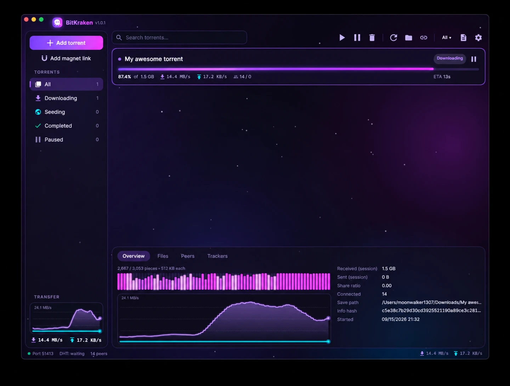

# BitKraken

A sleek, cross-platform BitTorrent client for macOS, Windows and Linux — built with **C# / .NET 10**,
[Avalonia UI](https://avaloniaui.net) and the [MonoTorrent](https://github.com/alanmcgovern/monotorrent) engine.

Dark, purple-tinted glass UI with an animated aurora backdrop, glowing progress bars, a live piece map and
real-time transfer graphs.



## Features

- **Torrents & magnets** — open `.torrent` files, paste magnet links, drag-and-drop onto the window, click a magnet
  link in your browser, or pass them on the command line (`BitKraken file.torrent` / `BitKraken "magnet:?..."`).
- **Clipboard watch** — copies a magnet link? BitKraken offers to add it (toggle in Settings).
- **Full engine** — DHT, PEX, local peer discovery, UPnP/NAT-PMP port forwarding, protocol encryption,
  per-file priorities, global rate limits, fast-resume and session restore.
- **Fast first peers** — a small set of well-known public trackers is appended to public torrents as they're added,
  which is usually the biggest cut to a magnet's time-to-first-peer. Never applied to private torrents; toggle in
  Settings.
- **Bind to an interface** — pin peer connections, HTTP tracker announces and DHT to one network interface.
  Point it at your VPN tunnel and nothing takes your normal connection instead.
- **Kill switch** — if the bound interface drops, torrents are held and connections refused until it is
  back, then the ones it stopped start again on their own.
- **SOCKS5 / HTTP proxy** — send peers and trackers through a proxy, with the hostname resolved at the
  far end. UDP trackers, DHT, local peer discovery and the incoming listener switch off while it's on,
  because a TCP proxy can't carry them.
- **Details panel** — overview (piece map + speed graph + stats), files (priority / skip), peers, trackers.
- **Filters & search** — All / Downloading / Seeding / Completed / Paused / Errors, plus instant name search.
- **Per-torrent actions** — resume, pause, force re-check, open folder, copy magnet link and remove, from the
  right-click menu.
- **Keyboard** — `Ctrl/⌘+O` add file, `Ctrl/⌘+M` add magnet, `Ctrl/⌘+,` settings, `Delete` remove.
- **Easy on older machines** — the animated aurora background can be turned off in Settings.

The title bar shows the running build's version, so a packaged build says exactly what it is.

## Magnet links from your browser

Clicking a magnet link on a torrent site hands it straight to BitKraken: the window comes forward and the torrent is
added (queued if the engine is still starting up). A second launch never starts a second engine — it passes its
arguments to the instance that is already running and exits.

Each desktop delivers the link differently, and BitKraken registers itself for all three:

| Platform | How it's wired up |
| --- | --- |
| macOS | The `BitKraken.app` bundle declares the `magnet:` scheme, and macOS delivers the link as a URL event — it never appears on the command line. Use the packaged app (see below), not the bare binary. |
| Windows | `HKCU\Software\Classes\magnet` is pointed at the running executable on startup. |
| Linux | `~/.local/share/applications/bitkraken.desktop` is written with `x-scheme-handler/magnet` and made the default with `xdg-mime`. |

Turning **Settings → Open magnet links from the browser** off removes the association again (on Windows and Linux;
on macOS it belongs to the bundle). Move or re-install the app and the association follows it on the next start.

## Binding to a VPN (or any interface)

**Settings → Bind to network interface** pins BitKraken to one interface — typically the tunnel your VPN
client creates (`wg0`, `tun0`, `utun4`, "ProtonVPN"). While it is set:

- the peer listener binds to that interface's address instead of `0.0.0.0`, so incoming connections can
  only arrive over it;
- outgoing peer connections are bound to it as well. This is the part that matters: the routing table,
  not the listening socket, decides where an outgoing connection leaves from, so binding only the
  listener would still put peer traffic on your normal connection;
- HTTP(S) tracker announces go out of it too — an announce carries your IP as surely as a peer does;
- DHT binds its socket to it;
- UPnP/NAT-PMP port forwarding is switched off, because a mapping to a VPN address does nothing and the
  request itself tells your router what you're up to.

The address family follows the interface: bind to a tunnel with no IPv6 and BitKraken makes no IPv6
connections at all.

### The kill switch

If the bound interface disappears — the tunnel drops — BitKraken doesn't fall back to your real
connection. It stops every torrent that was running, drops its listeners, and refuses to open new
connections; the status bar says which interface is down. When the interface comes back it rebinds and
restarts exactly the torrents it stopped. Torrents you paused yourself stay paused, and a torrent you
start while the tunnel is down is queued rather than sent out over the wrong interface.

The interface list is re-read every five seconds as well as on the OS's own network-change events, since
those don't fire reliably for tunnel interfaces on every platform.

Two things still follow the system routing table, and they will use your normal connection if your VPN is
*not* the default route (a split tunnel): UDP tracker announces, which MonoTorrent sends from an unbound
socket, and DNS lookups for tracker hostnames. In the usual setup, where the VPN *is* the default route,
they go over the tunnel like everything else.

## Proxy

**Settings → Proxy** sends peer connections and tracker announces through a SOCKS5 (RFC 1928) or HTTP
CONNECT proxy — the kind VPN providers hand out for torrent clients. Username/password authentication is
supported for both (RFC 1929 and Basic, respectively).

Target hostnames are handed to the proxy to resolve rather than looked up here, so tracker names don't
leak as DNS queries from your machine. If the proxy is selected but misconfigured, connections fail with
the proxy's own error — BitKraken never falls back to a direct connection.

A SOCKS5 or HTTP proxy carries TCP only, so while one is set BitKraken turns off everything that isn't:

| | Why |
| --- | --- |
| UDP trackers | UDP can't cross the proxy. They stay in the tracker list, marked as not announced, rather than silently announcing from your own address — the bundled public trackers are all UDP, so expect them to sit idle. |
| DHT | Also UDP. |
| Local peer discovery | A multicast shout on the LAN, which no proxy can carry. |
| Incoming connections | The listener is stopped: a peer reaching your real address defeats the point. |
| UPnP / NAT-PMP | Nothing to forward while nothing is listening. |

That leaves HTTP(S) trackers and outgoing peer connections, which is the usual trade for a proxy.
Binding and a proxy compose: the connection to the proxy itself is made from the bound interface.

The proxy password is stored in `settings.json` in plain text, like the rest of your settings. On macOS
and Linux that file is written readable by its owner only; on Windows the per-user AppData folder is the
protection.

## Requirements

- [.NET 10 SDK](https://dotnet.microsoft.com/download) to build (the published binaries are self-contained).

## Run from source

```bash
dotnet run --project src/BitKraken
```

## Tests

```bash
dotnet test tests/BitKraken.Tests
```

Unit tests cover the pure logic: display formatting, settings persistence (including the fallback
when `settings.json` is corrupt and the defaults an older build never wrote), the settings clone the
dialog edits before you press OK, the shell-argument normalization behind magnet links, the version
string shown in the title bar, and the tag arithmetic in `scripts/next-version.sh`. They run on
every push, and a red run blocks the installer build.

## Publish self-contained binaries

```bash
scripts/publish.sh                 # all platforms
scripts/publish.sh osx-arm64       # or just one RID
```

On Windows: `.\scripts\publish.ps1 -Rids win-x64`. Output lands in `publish/<rid>/`.

Supported RIDs: `win-x64`, `win-arm64`, `linux-x64`, `linux-arm64`, `osx-x64`, `osx-arm64`.

## Installers

macOS gets a real `.app` bundle plus installers and Windows a setup `.exe`; every platform also gets a
self-contained single-file build in an archive, for anyone who would rather not install anything. Build them
locally with:

```bash
scripts/package-macos.sh osx-arm64 1.0.0      # .dmg + .pkg
scripts/package-windows.sh win-x64 1.0.0      # setup .exe   (Windows only, needs Inno Setup 6)
scripts/package-portable.sh win-x64 1.0.0     # .zip
scripts/package-portable.sh linux-x64 1.0.0   # .tar.gz
```

Everything lands in `dist/`:

| Platform | RID | Packages |
| --- | --- | --- |
| macOS (Apple Silicon) | `osx-arm64` | `.dmg` (drag-to-Applications) and `.pkg` (installer), from a `BitKraken.app` bundle that registers the `.torrent` file type and `magnet:` URL scheme |
| Windows | `win-x64`, `win-arm64` | `-setup.exe` (Start Menu shortcut, optional desktop icon and `.torrent` association, clean uninstall; installs per-user without admin, or for all users) and `.zip` (portable) |
| Linux | `linux-x64`, `linux-arm64` | `.tar.gz` |

The [installers workflow](.github/workflows/installers.yml) builds all five in parallel on macOS, Windows and Linux
runners:

- **Pull request** → builds a **preview**, `1.0.x-preview`, and uploads every platform's packages as workflow artifacts.
- **Merge to `main`** → builds `1.0.x`, tags the commit `v1.0.x` and publishes a GitHub **release** with all the
  packages attached, so it shows up under *Releases*. Only pushes that touch [`src/`](src) build: a merge that
  changes nothing but docs, scripts or packaging is skipped and releases nothing.
- **Tag push** `v1.2.3` → builds that exact version and publishes the release.
- **Run workflow** (manual) → builds with the version you enter, or the next `1.0.x` if you leave it empty.

### Versioning

Versions are `1.0.x`, where `x` is the patch of the highest existing `v1.0.*` tag plus one — so the first merge to
`main` releases `1.0.0`, the next `1.0.1`, and so on. A pull request builds the same next patch with a `-preview`
suffix, which is a preview of what merging it would release. [`scripts/next-version.sh`](scripts/next-version.sh)
computes it and can be run locally:

```bash
scripts/next-version.sh release   # 1.0.3
scripts/next-version.sh preview   # 1.0.3-preview
scripts/next-version.sh current   # 1.0.2 (the latest released version)
```

Releases are the source of truth for the counter, so nothing needs to be committed to bump a version. To move to a
new series, push a tag for it (e.g. `v1.1.0`) or set `VERSION_SERIES=1.1`. Pre-release suffixes are kept in file
names and .NET assembly metadata; the app bundle and `.pkg` get the numeric `1.0.x` core, which is all macOS accepts.

macOS packages are ad-hoc signed unless you add these repository secrets, in which case they are Developer ID signed and
notarized: `MACOS_CERTIFICATE_P12` (base64 `.p12`), `MACOS_CERTIFICATE_PASSWORD`, `MACOS_SIGNING_IDENTITY`
(`Developer ID Application: …`), `MACOS_INSTALLER_IDENTITY` (`Developer ID Installer: …`), `APPLE_ID`,
`APPLE_TEAM_ID`, `APPLE_APP_PASSWORD` (app-specific password).

## Where data lives

| What | Location |
| --- | --- |
| Downloads | `~/Downloads/BitKraken` (changeable in Settings) |
| Settings, session state, fast-resume, DHT cache | `%APPDATA%\BitKraken` (Windows), `~/Library/Application Support/BitKraken` (macOS), `~/.config/BitKraken` (Linux) |

## Project layout

```
src/BitKraken/
  Program.cs     Entry point: hands off to a running instance, then starts Avalonia
  AppInfo.cs     The running build's version, as shown in the title bar
  Format.cs      Sizes, rates, durations and ratios as the UI shows them
  Controls/      Custom-drawn controls: AuroraBackground, GlowProgressBar, PieceMap, SpeedGraph
  Models/        AppSettings — everything Settings persists to settings.json
  Services/      TorrentService (MonoTorrent wrapper), SettingsService, ShellIntegration
                 (magnet / .torrent registration), SingleInstance, IDialogService
  ViewModels/    MVVM view-models (CommunityToolkit.Mvvm)
  Views/         MainWindow + Add / Settings / Remove dialogs (Avalonia XAML)
  Styles/        Colors.axaml (palette, icons) and Theme.axaml (control styles, animations)
  Assets/        App icon (.ico / .png)
  Diagnostics/   Env-var driven dev hooks (headless screenshots)
tests/BitKraken.Tests/   xUnit tests for the logic that does not need a window
```

### Developer hooks

For headless UI checks the app honours a few environment variables:

| Variable | Effect |
| --- | --- |
| `BITKRAKEN_SCREENSHOT=/path/out.png` | Render the main window to a PNG after it opens |
| `BITKRAKEN_SCREENSHOT_DELAY=<seconds>` | Delay before rendering (default 6) |
| `BITKRAKEN_DEBUG_SELECT=1` | Select the first torrent first |
| `BITKRAKEN_DEBUG_TAB=<0-3>` | Pick a details tab |
| `BITKRAKEN_DEBUG_DIALOG=add\|settings\|remove` | Also open that dialog and render it to `out-dialog.png` |
| `BITKRAKEN_DEBUG_CLOSE_AFTER=<seconds>` | Close the window (exercising clean shutdown) |

## License

MIT
